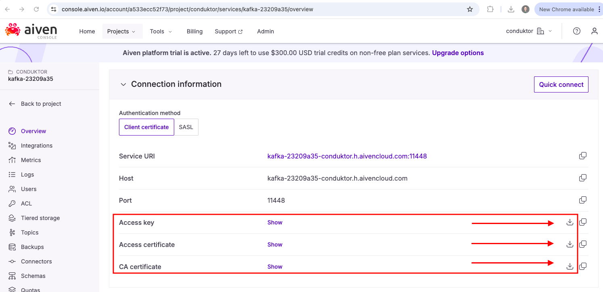

# aiven

*you need to have docker installed to run this lab and an aiven kafka cluster*

create a .env file and put the token in there like in the below example
```
MANAGED_KAFKA_BOOTSTRAP_SERVERS=aiven_kafka_cluster:aiven_port
CDK_LICENSE=_get_a_license_from_conduktor_
GATEWAY_ADVERTISED_HOST=conduktor-gateway-multi-tenancy
TRUSTSTORE_PASSWORD=***
KEYSTORE_PASSWORD=***
KEY_PASSWORD=***
```

You will need to download the *Access key*, *Access Certificate*, and *CA Certificate* from your Aiven kafka cluster and store them in this project directory




when everything is configured turn everything on
```
docker compose up -d
```

now you will need to add the gateway running to console for partner zones, run the following program
```
./add_gateway_to_console.sh
```

add shadow traffic for financial data
```
./add_shadow_traffic.sh
```

*you will need a shadow traffic license[ShadowTraffic](https://shadowtraffic.io/) [Data Generated Source](https://github.com/ShadowTraffic/shadowtraffic-examples/blob/master/kafka-retail.json) , put the file in the path below*

`~/shadowtraffic`

finally, lets encrypt that financial data!

`./add_interceptors.sh`

shut everything down
```
sudo docker compose down -v
```
